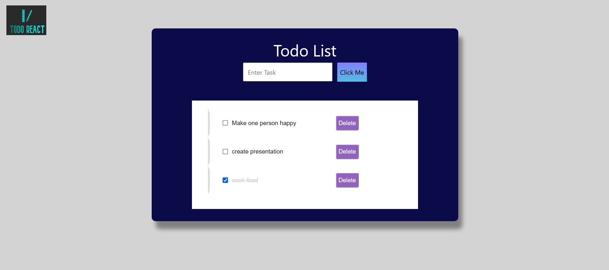

> A React powered todo app.

**Hey!** This is my first project in React.

> Live app- https://todo-app-react-d35c6.web.app/



## Installation

```sh
git clone https://github.com/uditsingh07/react-todo-app.git 
cd react-todo-app
In CLI write npm install
In CLI write npm start

# To build the app for production, run the following command:
npm run bundle
```
**Here you Go !!**


**Pull Requests and Issues are welcomed.**
